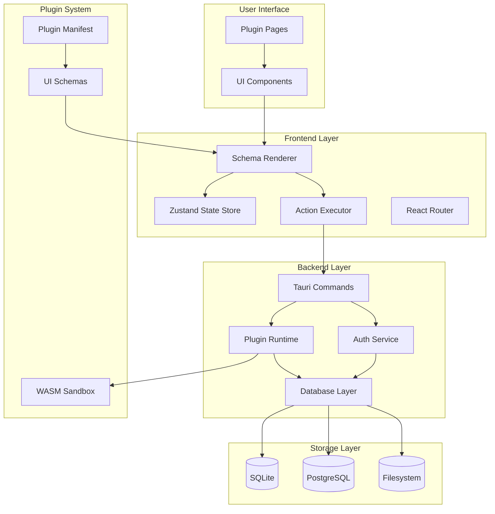
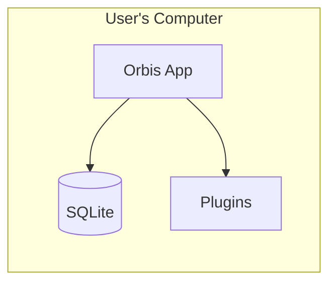
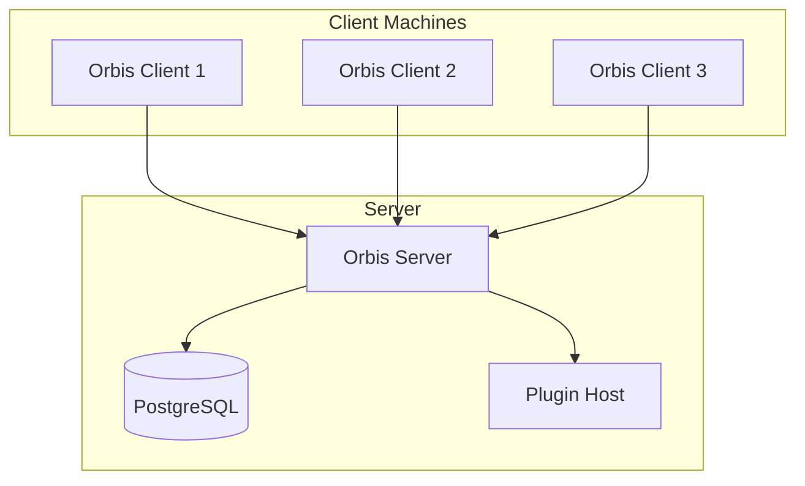
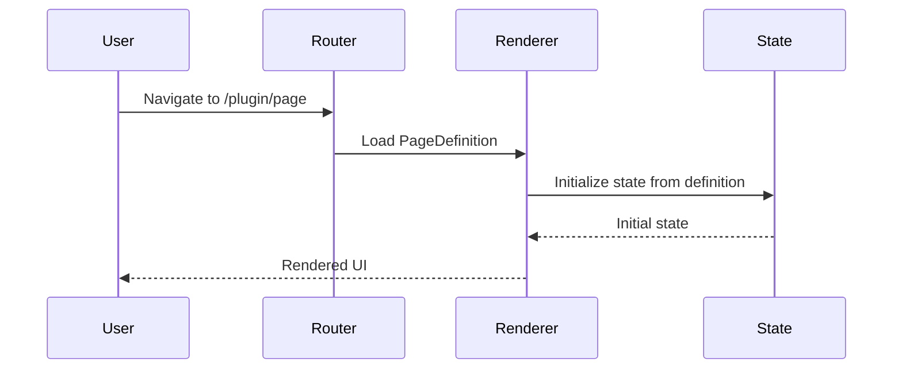
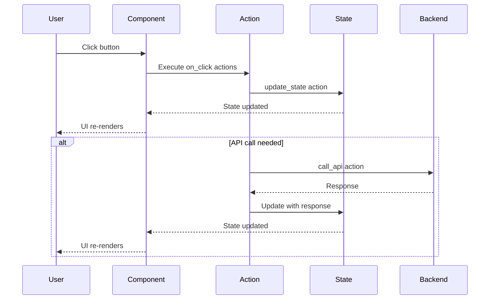
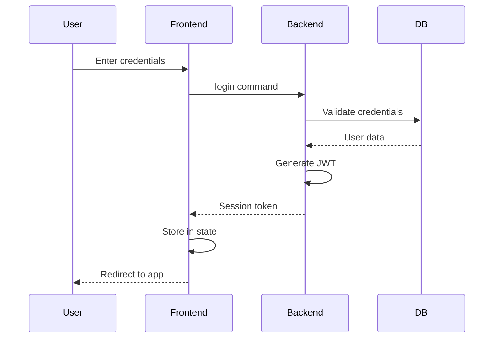

import CodeBlock from '@/components/mdx/CodeBlock.astro';
import Mermaid from '@/components/mdx/Mermaid.astro';


# Architecture

Orbis uses a layered architecture that separates concerns between the frontend, backend, and plugin system.

## System Overview

<Mermaid>

</Mermaid>

## Layers Explained

### 1. User Interface Layer

The visible part of the application where users interact with plugins.

**Responsibilities:**
- Display plugin pages
- Handle user input
- Show feedback (toasts, modals, etc.)

**Key Insight:** Users don't see "Orbis" - they see plugin UIs rendered from schemas.

### 2. Frontend Layer

React application that interprets schemas and manages state.

| Component | Purpose |
|-----------|---------|
| **Schema Renderer** | Converts JSON schemas to React components |
| **State Store** | Manages reactive page state with Zustand |
| **Action Executor** | Processes action schemas (clicks, form submits) |
| **Router** | Handles navigation between plugin pages |

### 3. Backend Layer

Rust-powered backend running in Tauri.

| Service | Purpose |
|---------|---------|
| **Tauri Commands** | IPC bridge between frontend and backend |
| **Plugin Runtime** | Loads and executes WASM plugins |
| **Auth Service** | Handles authentication and sessions |
| **Database Layer** | Abstracts SQLite/PostgreSQL access |

### 4. Plugin System

Sandboxed plugin execution environment.

| Component | Purpose |
|-----------|---------|
| **WASM Sandbox** | Secure plugin execution |
| **Plugin Manifest** | Declarative plugin configuration |
| **UI Schemas** | JSON-based UI definitions |

### 5. Storage Layer

Pluggable database backend supporting two modes:

- **SQLite**: Embedded database for standalone mode
- **PostgreSQL**: External database for client-server mode
- **Filesystem**: For storing plugin assets and user data

## Deployment Modes

Orbis supports two deployment architectures:

### Standalone Mode

Everything runs locally on the user's machine.

<Mermaid>

</Mermaid>

**Use Cases:**
- Personal productivity apps
- Development and testing
- Offline-first applications

### Client-Server Mode

Multiple clients connect to a shared backend.

<Mermaid>

</Mermaid>

**Use Cases:**
- Team collaboration
- Enterprise deployments
- Multi-user applications

## Data Flow

### Rendering Flow

How a plugin page gets displayed:

<Mermaid>

</Mermaid>

### Interaction Flow

How user interactions are processed:

<Mermaid>

</Mermaid>

## Security Architecture

### Plugin Sandboxing

Plugins run in isolated WASM sandboxes with:

- **No direct filesystem access** (requires permissions)
- **No network access** (requires permissions)
- **Memory isolation** (separate address space)
- **Capability-based security** (explicit permission grants)

<CodeBlock lang="rust">
```rust
// Plugin permissions in manifest
{
  "permissions": [
    { "type": "network", "allowed_hosts": ["api.example.com"] },
    { "type": "storage", "scope": "plugin-data" }
  ]
}
```
</CodeBlock>

### Authentication Flow

<Mermaid>

</Mermaid>

## Performance Considerations

### Schema Renderer

The `SchemaRenderer` processes JSON schemas into React components. Key optimizations:

- Expression caching (avoid re-parsing)
- Memoization for static components
- Virtual scrolling for large lists

### State Management

Zustand with Immer provides:

- Immutable updates without boilerplate
- Selective re-renders via subscriptions
- Efficient nested state updates

### Plugin Loading

- Lazy loading of plugin pages
- Manifest caching
- Hot reload in development

## Extension Points

Orbis is designed for extensibility:

| Extension Point | Mechanism |
|-----------------|-----------|
| New components | Add to `ui.rs` + `components.ts` + `renderer.tsx` |
| New actions | Add to `ui.rs` + `actions.ts` |
| Custom schemas | Plugin manifest `pages` array |
| Backend APIs | Tauri commands + plugin routes |

## Next Steps

- **[Plugin System](./plugin-system)** - Deep dive into how plugins work
- **[Schema System](./schema-system)** - Understanding UI schemas
- **[State Management](./state-management)** - Reactive state in depth
