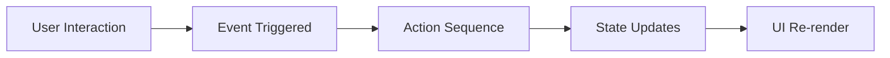

import CodeBlock from '@/components/mdx/CodeBlock.astro';
import Mermaid from '@/components/mdx/Mermaid.astro';
import Callout from '@/components/mdx/Callout.astro';


# Event Handling

Events connect user interactions to actions. When a user clicks a button, submits a form, or changes an input, events trigger action sequences that update state and interact with the system.

## Overview

Event handling in Orbis follows this pattern:

<Mermaid>

</Mermaid>

## Event Handler Structure

Events are defined in the `events` property of components:

<CodeBlock lang="json">
```json
{
  "type": "Button",
  "label": "Click Me",
  "events": {
    "on_click": [
      { "type": "update_state", "path": "clicked", "value": true },
      { "type": "show_toast", "message": "Button clicked!" }
    ]
  }
}
```
</CodeBlock>

Each event handler is an array of actions that execute in sequence.

## Available Events

### Mouse Events

| Event | Triggered When | Components |
|-------|----------------|------------|
| `on_click` | Element is clicked | Most components |
| `on_double_click` | Element is double-clicked | Container, Card, etc. |
| `on_mouse_enter` | Mouse enters element | Container, Card |
| `on_mouse_leave` | Mouse leaves element | Container, Card |

### Form Events

| Event | Triggered When | Components |
|-------|----------------|------------|
| `on_change` | Input value changes | Field, Form inputs |
| `on_submit` | Form is submitted | Form |
| `on_focus` | Input gains focus | Field |
| `on_blur` | Input loses focus | Field |

### Keyboard Events

| Event | Triggered When | Components |
|-------|----------------|------------|
| `on_key_down` | Key is pressed | Input fields |
| `on_key_up` | Key is released | Input fields |

### Data Events

| Event | Triggered When | Components |
|-------|----------------|------------|
| `on_row_click` | Table row is clicked | Table, List |
| `on_row_double_click` | Table row is double-clicked | Table |
| `on_select` | Item is selected | Table, Select |
| `on_clear` | Selection is cleared | Select |
| `on_search` | Search query changes | Searchable components |
| `on_page_change` | Table page changes | Table |
| `on_sort_change` | Table sort changes | Table |
| `on_filter_change` | Filter is applied | Table |

### Lifecycle Events

| Event | Triggered When | Components |
|-------|----------------|------------|
| `on_load` | Component/data loads | Image, async components |
| `on_error` | Error occurs | Image, async components |
| `on_open` | Overlay opens | Modal, Dropdown |
| `on_close` | Overlay closes | Modal, Dropdown, Alert |

## Event Object

Event handlers receive context about the event through special variables.

### $event

The raw event object:

<CodeBlock lang="json">
```json
{
  "events": {
    "on_click": [
      {
        "type": "update_state",
        "path": "lastClick",
        "value": "$event"
      }
    ]
  }
}
```
</CodeBlock>

### $event.value

For input events, the current value:

<CodeBlock lang="json">
```json
{
  "type": "Field",
  "name": "search",
  "events": {
    "on_change": [
      {
        "type": "update_state",
        "path": "searchQuery",
        "value": "$event.value"
      }
    ]
  }
}
```
</CodeBlock>

### $event.target

The element that triggered the event:

<CodeBlock lang="json">
```json
{
  "events": {
    "on_focus": [
      {
        "type": "update_state",
        "path": "focusedField",
        "value": "$event.target.name"
      }
    ]
  }
}
```
</CodeBlock>

## Row/Item Context

When events occur within lists or tables, additional context is available:

### $row

Current table row data:

<CodeBlock lang="json">
```json
{
  "type": "Table",
  "events": {
    "on_row_click": [
      {
        "type": "update_state",
        "path": "selectedUser",
        "value": "$row"
      },
      {
        "type": "navigate",
        "to": "/users/{{$row.id}}"
      }
    ]
  }
}
```
</CodeBlock>

### $item

Current loop/list item:

<CodeBlock lang="json">
```json
{
  "type": "Loop",
  "dataSource": "state:items",
  "template": {
    "type": "Button",
    "label": "Delete {{$item.name}}",
    "events": {
      "on_click": [
        {
          "type": "update_state",
          "path": "items",
          "mode": "remove",
          "value": "{{$item.id}}"
        }
      ]
    }
  }
}
```
</CodeBlock>

### $index

Current iteration index:

<CodeBlock lang="json">
```json
{
  "type": "Loop",
  "template": {
    "type": "Button",
    "label": "Item {{$index + 1}}",
    "events": {
      "on_click": [
        {
          "type": "update_state",
          "path": "selectedIndex",
          "value": "$index"
        }
      ]
    }
  }
}
```
</CodeBlock>

## Action Sequences

Events execute actions in sequence. Actions can be:

### Independent Actions

Run in order, each completing before the next:

<CodeBlock lang="json">
```json
{
  "on_click": [
    { "type": "update_state", "path": "step", "value": 1 },
    { "type": "update_state", "path": "step", "value": 2 },
    { "type": "show_toast", "message": "Step is now 2" }
  ]
}
```
</CodeBlock>

### Conditional Flow

Branch based on conditions:

<CodeBlock lang="json">
```json
{
  "on_click": [
    {
      "type": "conditional",
      "condition": "{{state.isValid}}",
      "then": [
        { "type": "call_api", "api": "submit" }
      ],
      "else": [
        { "type": "show_toast", "message": "Please fix errors", "level": "error" }
      ]
    }
  ]
}
```
</CodeBlock>

### Async Actions

API calls with callbacks:

<CodeBlock lang="json">
```json
{
  "on_click": [
    { "type": "set_loading", "loading": true },
    {
      "type": "call_api",
      "api": "my-plugin.saveData",
      "on_success": [
        { "type": "show_toast", "message": "Saved!", "level": "success" }
      ],
      "on_error": [
        { "type": "show_toast", "message": "Failed: {{$error.message}}", "level": "error" }
      ]
    },
    { "type": "set_loading", "loading": false }
  ]
}
```
</CodeBlock>

<Callout type="warning">
The `set_loading` after `call_api` runs immediately, not after the API completes. Use the `on_success`/`on_error` callbacks for post-API actions.
</Callout>

## Component-Specific Events

### Button

<CodeBlock lang="json">
```json
{
  "type": "Button",
  "label": "Submit",
  "events": {
    "on_click": [{ "type": "call_api", "api": "submit" }]
  }
}
```
</CodeBlock>

### Field (Input)

<CodeBlock lang="json">
```json
{
  "type": "Field",
  "name": "email",
  "fieldType": "email",
  "events": {
    "on_change": [{ "type": "update_state", "path": "email", "value": "$event.value" }],
    "on_focus": [{ "type": "update_state", "path": "focused", "value": "email" }],
    "on_blur": [{ "type": "validateForm", "formId": "my-form" }]
  }
}
```
</CodeBlock>

### Form

<CodeBlock lang="json">
```json
{
  "type": "Form",
  "id": "contact-form",
  "events": {
    "on_submit": [
      { "type": "validateForm", "formId": "contact-form" },
      {
        "type": "conditional",
        "condition": "{{state.formValid}}",
        "then": [
          { "type": "call_api", "api": "submitContact" }
        ]
      }
    ]
  }
}
```
</CodeBlock>

### Table

<CodeBlock lang="json">
```json
{
  "type": "Table",
  "columns": [...],
  "dataSource": "state:users",
  "events": {
    "on_row_click": [
      { "type": "update_state", "path": "selectedUser", "value": "$row" }
    ],
    "on_select": [
      { "type": "update_state", "path": "selectedUsers", "value": "$event.value" }
    ],
    "on_page_change": [
      { "type": "update_state", "path": "currentPage", "value": "$event.value" }
    ],
    "on_sort_change": [
      {
        "type": "update_state",
        "path": "sort",
        "value": {
          "column": "$event.column",
          "direction": "$event.direction"
        }
      }
    ]
  }
}
```
</CodeBlock>

### Modal

<CodeBlock lang="json">
```json
{
  "type": "Modal",
  "id": "confirm-dialog",
  "events": {
    "on_open": [
      { "type": "update_state", "path": "modalOpen", "value": true }
    ],
    "on_close": [
      { "type": "update_state", "path": "modalOpen", "value": false },
      { "type": "update_state", "path": "selectedItem", "value": null }
    ]
  }
}
```
</CodeBlock>

## Event Bubbling

Events don't bubble by default. Each component handles its own events.

To handle parent clicks while ignoring child clicks:

<CodeBlock lang="json">
```json
{
  "type": "Container",
  "events": {
    "on_click": [{ "type": "update_state", "path": "containerClicked", "value": true }]
  },
  "children": [
    {
      "type": "Button",
      "label": "Inner Button",
      "events": {
        "on_click": [
          // This runs, container's on_click does NOT run
          { "type": "update_state", "path": "button_clicked", "value": true }
        ]
      }
    }
  ]
}
```
</CodeBlock>

## Best Practices

### Keep Handlers Focused

<CodeBlock lang="json">
```json
// Good - clear purpose
{
  "on_click": [
    { "type": "update_state", "path": "isOpen", "value": true }
  ]
}

// ❌ Avoid - too many concerns
{
  "on_click": [
    { "type": "update_state", "path": "isOpen", "value": true },
    { "type": "update_state", "path": "lastOpened", "value": "now" },
    { "type": "call_api", "api": "logEvent" },
    { "type": "show_toast", "message": "Opened" }
  ]
}
```
</CodeBlock>

### Use Descriptive State Paths

<CodeBlock lang="json">
```json
// Good
{ "type": "update_state", "path": "form.isSubmitting", "value": true }

// ❌ Avoid
{ "type": "update_state", "path": "s", "value": true }
```
</CodeBlock>

### Handle Loading and Errors

Always handle async operation states:

<CodeBlock lang="json">
```json
{
  "on_click": [
    { "type": "set_loading", "target": "submit", "loading": true },
    {
      "type": "call_api",
      "api": "submit",
      "on_success": [
        { "type": "set_loading", "target": "submit", "loading": false },
        { "type": "show_toast", "message": "Success!" }
      ],
      "on_error": [
        { "type": "set_loading", "target": "submit", "loading": false },
        { "type": "show_toast", "message": "Failed!", "level": "error" }
      ]
    }
  ]
}
```
</CodeBlock>

## Debugging Events

### Log State Changes

Use temporary state to debug:

<CodeBlock lang="json">
```json
{
  "on_click": [
    { "type": "update_state", "path": "debug.lastEvent", "value": "button clicked" },
    { "type": "update_state", "path": "debug.timestamp", "value": "{{Date.now()}}" }
  ]
}
```
</CodeBlock>

### Development Logging

Enable debug mode:

<CodeBlock lang="bash">
```bash
RUST_LOG=debug,orbis=trace bun run tauri dev
```
</CodeBlock>

## Next Steps

- **[Actions Overview](../actions/overview)** - All action types
- **[Update State](../actions/update-state)** - State modification actions
- **[Call API](../actions/call-api)** - Making API requests
