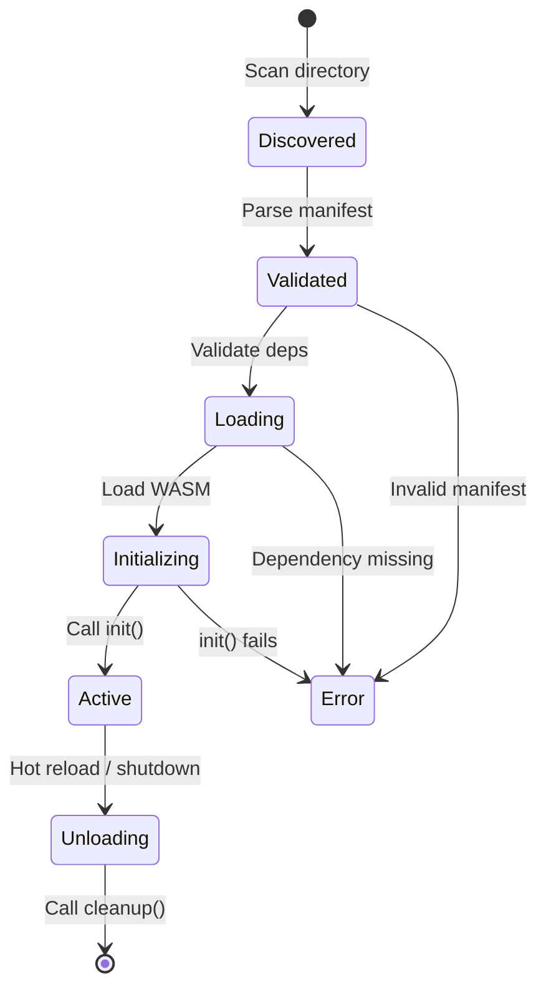

import CodeBlock from '@/components/mdx/CodeBlock.astro';
import Mermaid from '@/components/mdx/Mermaid.astro';

Orbis uses a plugin architecture where all application functionality is delivered through plugins. This guide explains how the plugin system works.

## Overview

Plugins in Orbis are self-contained modules that can:

- Define UI pages with JSON schemas
- Expose API routes
- Execute backend logic in WASM sandboxes
- Store and retrieve data
- Communicate with other plugins

## Plugin Manifest

The manifest is the heart of every plugin. It defines metadata, pages, routes, and permissions.

<CodeBlock lang="json">
```json
{
  "name": "my-awesome-plugin",
  "version": "1.0.0",
  "description": "Does awesome things",
  "author": "Your Name",
  "homepage": "https://example.com",
  "license": "MIT",
  
  "min_orbis_version": "1.0.0",
  "dependencies": [],
  "permissions": [],
  
  "routes": [],
  "pages": [],
  
  "wasm_entry": "plugin.wasm",
  "config": {}
}
```
</CodeBlock>

### Manifest Fields

| Field | Required | Description |
|-------|----------|-------------|
| `name` | Yes | Unique plugin identifier (alphanumeric, hyphens, underscores) |
| `version` | Yes | Semantic version (e.g., "1.0.0") |
| `description` | No | Human-readable description |
| `author` | No | Plugin author |
| `homepage` | No | Plugin homepage URL |
| `license` | No | License identifier |
| `min_orbis_version` | No | Minimum required Orbis version |
| `dependencies` | No | Other required plugins |
| `permissions` | No | Requested capabilities |
| `routes` | No | API route definitions |
| `pages` | No | UI page definitions |
| `wasm_entry` | No | Path to WASM binary |
| `config` | No | Custom configuration |

## Page Definitions

Pages are the primary way plugins provide UI.

<CodeBlock lang="json">
```json
{
  "pages": [
    {
      "id": "dashboard",
      "title": "Dashboard",
      "route": "/my-plugin",
      "icon": "LayoutDashboard",
      "state": {
        "items": {
          "type": "array",
          "default": []
        }
      },
      "sections": {
        "type": "Container",
        "children": [
          {
            "type": "Heading",
            "text": "My Dashboard"
          }
        ]
      },
      "hooks": {
        "on_mount": [],
        "on_unmount": []
      }
    }
  ]
}
```
</CodeBlock>

### Page Fields

| Field | Description |
|-------|-------------|
| `id` | Unique page identifier within the plugin |
| `title` | Display title in navigation |
| `route` | URL path for the page |
| `icon` | Icon name from lucide-react |
| `state` | State definition for the page |
| `sections` | Root component schema |
| `hooks` | Lifecycle hooks for the page |

## Plugin Routes

Plugins can define HTTP-like routes for API functionality:

<CodeBlock lang="json">
```json
{
  "routes": [
    {
      "path": "/api/items",
      "method": "GET",
      "handler": "get_items"
    },
    {
      "path": "/api/items",
      "method": "POST",
      "handler": "create_item"
    },
    {
      "path": "/api/items/:id",
      "method": "DELETE",
      "handler": "delete_item"
    }
  ]
}
```
</CodeBlock>

Routes are called from UI via the `call_api` action:

<CodeBlock lang="json">
```json
{
  "type": "call_api",
  "api": "my-plugin.get_items",
  "on_success": [
    {
      "type": "update_state",
      "path": "items",
      "value": "$response.body.data"
    }
  ]
}
```
</CodeBlock>

## Permissions

Plugins declare required permissions in the manifest:

<CodeBlock lang="json">
```json
{
  "permissions": [
    {
      "type": "network",
      "allowed_hosts": ["api.example.com", "*.myapp.io"]
    },
    {
      "type": "storage",
      "scope": "plugin-data"
    },
    {
      "type": "ipc",
      "allowed_plugins": ["other-plugin"]
    }
  ]
}
```
</CodeBlock>

### Permission Types

| Type | Description |
|------|-------------|
| `network` | HTTP/HTTPS requests to specified hosts |
| `storage` | Database storage access |
| `filesystem` | Local file access (with path restrictions) |
| `ipc` | Inter-plugin communication |
| `notification` | System notifications |

## Plugin Dependencies

Plugins can depend on other plugins:

<CodeBlock lang="json">
```json
{
  "dependencies": [
    {
      "name": "auth-plugin",
      "version": ">=1.0.0"
    },
    {
      "name": "data-plugin",
      "version": "^2.0.0"
    }
  ]
}
```
</CodeBlock>

Orbis ensures dependencies are loaded before the dependent plugin.

## Plugin Loading

### Loading Formats

Orbis supports multiple plugin formats:

1. **Unpacked Directory** (development)
   ```
   plugins/my-plugin/
   ├── manifest.json
   └── plugin.wasm
   ```

2. **Packed ZIP** (distribution)
   ```
   plugins/my-plugin.zip
   ```

3. **Standalone WASM** (with embedded manifest)
   ```
   plugins/my-plugin.wasm
   ```

### Loading Order

1. Scan plugin directories
2. Parse manifests
3. Validate dependencies
4. Load in dependency order
5. Initialize WASM runtimes
6. Register routes and pages

### Hot Reload

In development mode, Orbis can hot reload changed plugins:

<CodeBlock lang="bash">
```bash
# Plugins in this directory are hot-reloaded
ORBIS_PLUGINS_DIR=./plugins
```
</CodeBlock>

When a plugin file changes:
1. Navigate to the plugin management page
2. Click "Reload" next to the plugin
3. Re-initialize if WASM changed
4. Re-render affected pages

## WASM Plugin Development

### Setting Up a WASM Plugin

<CodeBlock lang="bash">
```bash
cargo new --lib my-plugin
cd my-plugin
```
</CodeBlock>

**Cargo.toml:**

<CodeBlock lang="toml">
```toml
[package]
name = "my-plugin"
version = "0.1.0"
edition = "2021"

[lib]
crate-type = ["cdylib"]

[dependencies]
serde = { version = "1.0", features = ["derive"] }
serde_json = "1.0"
```
</CodeBlock>

### Plugin Entry Points

WASM plugins must be initialized using the `orbis_plugin!` macro, this optionally takes `init` and `cleanup` functions:

<CodeBlock lang="rust">
```rust
orbis_plugin!({
  init: || {
    // Initialize the plugin (called once at load)
    
    log::info!("Plugin starting!");
    state::set("initialized", &true)?;
    Ok(())
  },
  cleanup: || {
    // Clean up resources (called at unload)
    log::info!("Plugin stopping!");
    Ok(())
  }
})
```
</CodeBlock>

### Building WASM

<CodeBlock lang="bash">
```bash
# Add WASM target
rustup target add wasm32-unknown-unknown

# Build
cargo build --target wasm32-unknown-unknown --release

# Output at: target/wasm32-unknown-unknown/release/my_plugin.wasm
```
</CodeBlock>

### Embedding the Manifest

You can embed the manifest in the WASM binary:

<CodeBlock lang="bash">
```bash
# Using the provided Python script (running from project root)
cat manifest.json | python3 ./plugins/add_custom_section.py \
  my_plugin.wasm \
  -s manifest \
  -o my_plugin_with_manifest.wasm
```
</CodeBlock>

## Plugin Lifecycle

<Mermaid>

</Mermaid>

## Examples

Check the example plugins in the `plugins/` directory, [here](https://github.com/cyberpath-HQ/orbis/tree/main/plugins/).

## Next Steps

- **[Manifest Reference](../plugin-development/manifest)** - Complete manifest documentation
- **[WASM Plugins](../plugin-development/wasm-plugins)** - In-depth WASM guide
- **[Page Definitions](../plugin-development/page-definitions)** - UI page configuration
