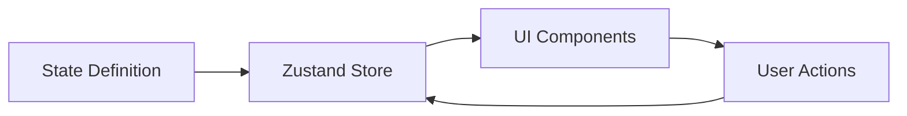
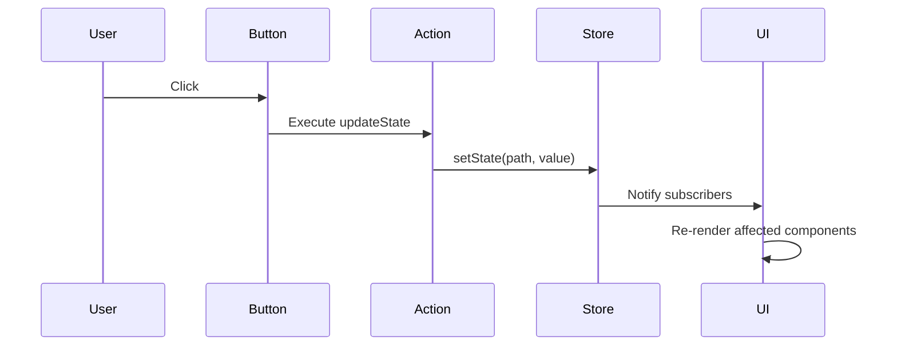

# State Management

Orbis uses a reactive state system powered by Zustand. Each page has its own isolated state store that drives UI updates.

## Overview

State in Orbis flows unidirectionally:



## Defining State

State is defined in the page's `state` field:

```json
{
  "pages": [
    {
      "id": "my-page",
      "state": {
        "username": {
          "type": "string",
          "default": "Guest"
        },
        "items": {
          "type": "array",
          "default": []
        },
        "settings": {
          "type": "object",
          "default": {
            "theme": "light",
            "notifications": true
          }
        },
        "count": {
          "type": "number",
          "default": 0
        },
        "isActive": {
          "type": "boolean",
          "default": false
        }
      },
      "layout": { ... }
    }
  ]
}
```

### State Field Definition

Each state field has:

| Property | Type | Description |
|----------|------|-------------|
| `type` | Required | `string`, `number`, `boolean`, `object`, `array` |
| `default` | Optional | Initial value (auto-generated if not provided) |
| `nullable` | Optional | Whether the field can be null |
| `description` | Optional | Documentation for the field |

### Default Values by Type

If no `default` is provided:

| Type | Default Value |
|------|---------------|
| `string` | `""` |
| `number` | `0` |
| `boolean` | `false` |
| `object` | `{}` |
| `array` | `[]` |

## Accessing State

State values are accessed in expressions using the `state.` prefix:

```json
{
  "type": "Text",
  "content": "Hello, {{state.username}}!"
}
```

### Nested State Access

Use dot notation for nested objects:

```json
{
  "type": "Text",
  "content": "Theme: {{state.settings.theme}}"
}
```

### Array Access

Access array elements by index or use loops:

```json
{
  "type": "Text",
  "content": "First item: {{state.items[0].name}}"
}
```

## Updating State

State is updated through the `updateState` action:

```json
{
  "type": "Button",
  "label": "Increment",
  "events": {
    "onClick": [
      {
        "type": "updateState",
        "path": "count",
        "value": "{{state.count + 1}}"
      }
    ]
  }
}
```

### Update Modes

The `updateState` action supports different modes:

#### Set (Default)

Replace the value completely:

```json
{
  "type": "updateState",
  "path": "username",
  "value": "John"
}
```

#### Merge

Merge objects (shallow):

```json
{
  "type": "updateState",
  "path": "settings",
  "mode": "merge",
  "value": {
    "theme": "dark"
  }
}
```

Result: `{ theme: "dark", notifications: true }`

#### Append

Add to arrays:

```json
{
  "type": "updateState",
  "path": "items",
  "mode": "append",
  "value": { "id": 1, "name": "New Item" }
}
```

#### Remove

Remove from arrays:

```json
{
  "type": "updateState",
  "path": "items",
  "mode": "remove",
  "value": "{{$item.id === 1}}"
}
```

### Nested Updates

Update nested properties directly:

```json
{
  "type": "updateState",
  "path": "settings.theme",
  "value": "dark"
}
```

## State Store API

Under the hood, Orbis creates a Zustand store for each page:

```typescript
interface PageStateStore {
  // Core state
  state: Record<string, unknown>;
  loading: Record<string, boolean>;
  errors: Record<string, string>;

  // Actions
  setState(path: string, value: unknown): void;
  mergeState(path: string, value: Record<string, unknown>): void;
  resetState(definition: StateDefinition): void;
  setLoading(key: string, loading: boolean): void;
  setError(key: string, error: string | null): void;
  clearErrors(): void;
  getState(): Record<string, unknown>;
  getValue(path: string): unknown;
}
```

## Loading States

Track loading status for async operations:

```json
{
  "type": "Button",
  "label": "Load Data",
  "loading": "{{state.loading.fetchData}}",
  "events": {
    "onClick": [
      {
        "type": "setLoading",
        "target": "fetchData",
        "loading": true
      },
      {
        "type": "callApi",
        "api": "my-plugin.getData",
        "onSuccess": [
          { "type": "updateState", "path": "data", "value": "$response.data" },
          { "type": "setLoading", "target": "fetchData", "loading": false }
        ],
        "onError": [
          { "type": "setLoading", "target": "fetchData", "loading": false }
        ]
      }
    ]
  }
}
```

## Error States

Store error messages in state:

```json
{
  "type": "callApi",
  "api": "my-plugin.submit",
  "onError": [
    {
      "type": "updateState",
      "path": "errors.submit",
      "value": "$error.message"
    }
  ]
}
```

Display errors conditionally:

```json
{
  "type": "Alert",
  "variant": "destructive",
  "visible": "{{state.errors.submit}}",
  "message": "{{state.errors.submit}}"
}
```

## Form Binding

Fields can bind directly to state:

```json
{
  "type": "Field",
  "name": "email",
  "fieldType": "email",
  "bindTo": "formData.email"
}
```

The field automatically:
- Reads its initial value from `state.formData.email`
- Updates `state.formData.email` on change

### Two-Way Binding

```json
{
  "state": {
    "formData": {
      "type": "object",
      "default": {
        "name": "",
        "email": "",
        "message": ""
      }
    }
  },
  "layout": {
    "type": "Form",
    "id": "contact-form",
    "fields": [
      { "name": "name", "fieldType": "text", "bindTo": "formData.name" },
      { "name": "email", "fieldType": "email", "bindTo": "formData.email" },
      { "name": "message", "fieldType": "textarea", "bindTo": "formData.message" }
    ]
  }
}
```

## State Initialization

### On Page Mount

Use `onMount` to initialize state when a page loads:

```json
{
  "pages": [
    {
      "id": "dashboard",
      "state": {
        "data": { "type": "array", "default": [] }
      },
      "onMount": [
        {
          "type": "callApi",
          "api": "my-plugin.getData",
          "onSuccess": [
            { "type": "updateState", "path": "data", "value": "$response.data" }
          ]
        }
      ],
      "layout": { ... }
    }
  ]
}
```

### Conditional Initialization

```json
{
  "onMount": [
    {
      "type": "conditional",
      "condition": "{{state.data.length === 0}}",
      "then": [
        { "type": "callApi", "api": "my-plugin.getData", ... }
      ]
    }
  ]
}
```

## State Cleanup

Use `onUnmount` to clean up when leaving a page:

```json
{
  "onUnmount": [
    {
      "type": "updateState",
      "path": "selectedItem",
      "value": null
    }
  ]
}
```

## State Isolation

Each page has its own isolated state store:

- State doesn't leak between pages
- Navigating away resets state (unless cached)
- Plugins can't access other plugins' state

### Sharing Data Between Pages

For shared data, use:

1. **Backend storage** - Persist to database
2. **URL parameters** - Pass via navigation
3. **API calls** - Fetch on each page load

## Reactive Updates

State changes trigger automatic UI updates:



Only components using the changed state values re-render.

## Performance Tips

### Minimize State Size

Keep state focused on what's needed:

```json
// ✅ Good
{
  "selectedId": { "type": "string" },
  "items": { "type": "array" }
}

// ❌ Avoid - storing derived data
{
  "selectedId": { "type": "string" },
  "items": { "type": "array" },
  "selectedItem": { "type": "object" },  // Can be derived
  "itemCount": { "type": "number" }       // Can be derived
}
```

### Normalize Complex Data

For complex relationships, use normalized structures:

```json
{
  "usersById": {
    "type": "object",
    "default": {
      "1": { "name": "Alice" },
      "2": { "name": "Bob" }
    }
  },
  "userIds": {
    "type": "array",
    "default": ["1", "2"]
  }
}
```

### Batch Updates

Multiple state changes in one action sequence are batched:

```json
{
  "events": {
    "onClick": [
      { "type": "updateState", "path": "a", "value": 1 },
      { "type": "updateState", "path": "b", "value": 2 },
      { "type": "updateState", "path": "c", "value": 3 }
    ]
  }
}
```

This causes only one re-render, not three.

## Debugging State

In development mode, state changes are logged:

```bash
RUST_LOG=debug bun run tauri dev
```

Watch the console for state updates:

```
[STATE] path: "count", value: 1
[STATE] path: "settings.theme", value: "dark"
```

## Next Steps

- **[Expressions](./expressions)** - Dynamic values in detail
- **[Event Handling](./event-handling)** - Responding to user input
- **[Actions](../actions/overview)** - All available actions
