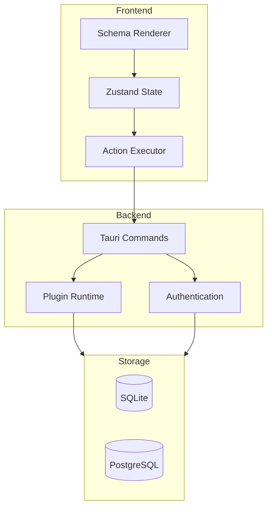

import CodeBlock from '@/components/mdx/CodeBlock.astro';
import Mermaid from '@/components/mdx/Mermaid.astro';

Orbis is a **plugin-driven desktop application platform** built with Rust and React. It enables developers to create powerful, extensible desktop applications using a declarative JSON-based UI schema system.

## What is Orbis?

Orbis provides a unique approach to building desktop applications:

- **Plugin Architecture**: Extend functionality through WASM-sandboxed plugins
- **Schema-Driven UI**: Define interfaces using JSON schemas instead of writing React code
- **Rust Backend**: High-performance, secure backend powered by Tauri
- **Two Deployment Modes**: Run standalone or in client-server mode for multi-user applications
- **shadcn/ui Components**: Beautiful, accessible UI components out of the box

## Key Features

### Declarative UI System

Plugins define their UI through JSON schemas that the Orbis renderer interprets:

<CodeBlock lang="json" title="example-schema.json">
```json
{
  "type": "Container",
  "children": [
    {
      "type": "Heading",
      "level": 1,
      "text": "Hello, {{state.username}}!"
    },
    {
      "type": "Button",
      "label": "Click Me",
      "events": {
        "onClick": [
          {
            "type": "update_state",
            "path": "clickCount",
            "value": "{{state.clickCount + 1}}"
          }
        ]
      }
    }
  ]
}
```
</CodeBlock>

### Plugin Sandboxing

Plugins run in WASM sandboxes with configurable permissions, ensuring security:

- Network access control
- Filesystem restrictions
- Inter-plugin communication
- Resource limits

### Reactive State Management

Built-in state management with Zustand provides reactive updates:

<CodeBlock lang="json">
```json
{
  "state": {
    "username": { "type": "string", "default": "Guest" },
    "clickCount": { "type": "number", "default": 0 }
  }
}
```
</CodeBlock>

## Architecture Overview

<Mermaid>

</Mermaid>

When you're ready to get started, check out the [Getting Started Guide](/docs/getting-started) to set up your first Orbis application!