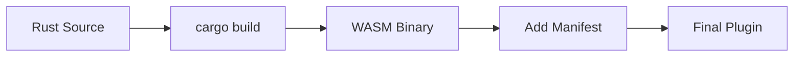

import CodeBlock from '@/components/mdx/CodeBlock.astro';
import Mermaid from '@/components/mdx/Mermaid.astro';


# Building Plugins

Learn how to build, package, and distribute your Orbis plugins.

## Build Process Overview

<Mermaid>

</Mermaid>

## Project Structure

### WASM Plugin (with SDK)

<CodeBlock lang="text">
```text
my-plugin/
├── Cargo.toml
├── manifest.json
├── build.sh (optional)
├── src/
│   ├── lib.rs
│   ├── handlers.rs (optional - organize routes)
│   └── models.rs (optional - data structures)
└── target/
    └── wasm32-unknown-unknown/
        └── release/
            └── my_plugin.wasm
```
</CodeBlock>

## Cargo Configuration

### Basic Setup

<CodeBlock lang="toml">
```toml
[package]
name = "my-plugin"
version = "1.0.0"
edition = "2021"

[lib]
crate-type = ["cdylib"]  # Required for WASM

[dependencies]
orbis-plugin-api = { path = "../../crates/orbis-plugin-api" }
serde = { version = "1.0", features = ["derive"] }
serde_json = "1.0"

[profile.release]
opt-level = "s"           # Optimize for size
lto = true                # Link-time optimization
strip = true              # Strip symbols
codegen-units = 1         # Single codegen unit
panic = "abort"           # Abort on panic (smaller)
```
</CodeBlock>

### SDK-Powered Plugin Example

<CodeBlock lang="rust">
```rust
// src/lib.rs
use orbis_plugin_api::sdk::prelude::*;
use serde_json::json;

// Zero-boilerplate initialization
orbis_plugin!();

fn get_items_impl(ctx: Context) -> Result<Response> {
    let items: Vec<String> = state::get("items")?.unwrap_or_default();
    Response::json(&json!({ "items": items }))
}

fn create_item_impl(ctx: Context) -> Result<Response> {
    #[derive(Deserialize)]
    struct NewItem { name: String }
    
    let item: NewItem = ctx.body_as()?;
    let mut items: Vec<String> = state::get("items")?.unwrap_or_default();
    items.push(item.name);
    state::set("items", &items)?;
    
    Response::json(&json!({ "message": "Created", "total": items.len() }))
}

// Export handlers for FFI
wrap_handler!(get_items, get_items_impl);
wrap_handler!(create_item, create_item_impl);
```
</CodeBlock>

### Optimization Tips

| Option | Effect | Trade-off |
|--------|--------|-----------|
| `opt-level = "s"` | Small binary | Slightly slower |
| `opt-level = "z"` | Smallest binary | Slower |
| `lto = true` | Smaller, faster | Longer compile |
| `strip = true` | Remove debug symbols | No stack traces |

## Build Script

### SDK-Based Build (Recommended)

For plugins using the Orbis SDK, the build process is simple:

<CodeBlock lang="bash">
```bash
#!/bin/bash
set -e

echo "Building plugin with Orbis SDK..."

# Build the WASM binary
cargo build --target wasm32-unknown-unknown --release

WASM_FILE="target/wasm32-unknown-unknown/release/my_plugin.wasm"

echo "Build complete: $WASM_FILE"
echo "Size: $(du -h $WASM_FILE | cut -f1)"

# Optional: Optimize with wasm-opt
if command -v wasm-opt &> /dev/null; then
    echo "Optimizing with wasm-opt..."
    wasm-opt -Os -o "${WASM_FILE}.opt" "$WASM_FILE"
    mv "${WASM_FILE}.opt" "$WASM_FILE"
    echo "Optimized size: $(du -h $WASM_FILE | cut -f1)"
fi
```
</CodeBlock>

**Note:** The SDK eliminates the need for manual manifest embedding. Just place `manifest.json` next to the WASM file.

### Advanced: Embedded Manifest Build

If you want to embed the manifest inside the WASM binary:

### Manifest Embedding Script (add_custom_section.py)

<CodeBlock lang="python">
```python
#!/usr/bin/env python3
"""Embed manifest.json as a custom section in WASM binary."""

import sys
import json
import struct

def add_custom_section(wasm_path: str, manifest_path: str):
    # Read manifest
    with open(manifest_path, 'r') as f:
        manifest = json.load(f)
    manifest_bytes = json.dumps(manifest, separators=(',', ':')).encode('utf-8')
    
    # Read WASM
    with open(wasm_path, 'rb') as f:
        wasm = bytearray(f.read())
    
    # Validate WASM magic
    if wasm[:4] != b'\x00asm':
        raise ValueError("Invalid WASM file")
    
    # Create custom section
    section_name = b'manifest'
    name_len = len(section_name)
    content = bytes([name_len]) + section_name + manifest_bytes
    
    # Section header: type (0) + length (LEB128)
    section = bytearray([0])  # Custom section type
    section.extend(encode_leb128(len(content)))
    section.extend(content)
    
    # Insert after WASM header (8 bytes)
    result = wasm[:8] + section + wasm[8:]
    
    # Write result
    with open(wasm_path, 'wb') as f:
        f.write(result)
    
    print(f"Added manifest section ({len(manifest_bytes)} bytes)")

def encode_leb128(value: int) -> bytes:
    """Encode unsigned integer as LEB128."""
    result = []
    while True:
        byte = value & 0x7f
        value >>= 7
        if value:
            byte |= 0x80
        result.append(byte)
        if not value:
            break
    return bytes(result)

if __name__ == '__main__':
    if len(sys.argv) != 3:
        print(f"Usage: {sys.argv[0]} <wasm_file> <manifest.json>")
        sys.exit(1)
    add_custom_section(sys.argv[1], sys.argv[2])
```
</CodeBlock>

## Alternative: External Manifest (Recommended with SDK)

The simplest deployment uses an external manifest file:

<CodeBlock lang="text">
```text
~/.orbis/plugins/my-plugin/
├── my_plugin.wasm
└── manifest.json
```
</CodeBlock>

Orbis searches for manifests in this order:
1. `manifest.json` next to WASM file **Recommended for SDK plugins**
2. `<plugin_name>.json` next to WASM file
3. Custom section in WASM binary (advanced)

**Advantages of external manifest:**
- Simpler build process (no embedding script needed)
- Easier to update manifest without rebuilding WASM
- Smaller WASM binary size
- Works seamlessly with the SDK

## Development Workflow

### Watch Mode (SDK Plugins)

For rapid iteration during development:

<CodeBlock lang="bash">
```bash
# Install cargo-watch
cargo install cargo-watch

# Auto-rebuild on Rust file changes
cargo watch -x 'build --target wasm32-unknown-unknown --release'

# In another terminal, watch and copy to plugin directory
cargo watch -s 'cp target/wasm32-unknown-unknown/release/my_plugin.wasm ~/.orbis/plugins/my-plugin/'
```
</CodeBlock>

### Testing During Development

<CodeBlock lang="bash">
```bash
# Build and install in one command
build_and_install() {
    cargo build --target wasm32-unknown-unknown --release && \
    cp target/wasm32-unknown-unknown/release/my_plugin.wasm ~/.orbis/plugins/my-plugin/ && \
    cp manifest.json ~/.orbis/plugins/my-plugin/ && \
    echo "Plugin updated! Reload Orbis to see changes."
}

# Use it
build_and_install
```
</CodeBlock>

### Debug Builds

For development with better error messages:

<CodeBlock lang="toml">
```toml
[profile.dev]
opt-level = 0
debug = true
panic = "unwind"  # Better stack traces
```
</CodeBlock>

<CodeBlock lang="bash">
```bash
cargo build --target wasm32-unknown-unknown
# Output: target/wasm32-unknown-unknown/debug/my_plugin.wasm
```
</CodeBlock>

### Validation

Before deploying, validate your plugin:

<CodeBlock lang="bash">
```bash
# Check WASM validity
wasm-validate target/wasm32-unknown-unknown/release/my_plugin.wasm

# Verify exports
wasm2wat target/wasm32-unknown-unknown/release/my_plugin.wasm | grep '(export'

# Check size
ls -lh target/wasm32-unknown-unknown/release/my_plugin.wasm
```
</CodeBlock>

Expected exports:
<CodeBlock lang="text">
```text
(export "init" (func $init))
(export "execute" (func $execute))
(export "cleanup" (func $cleanup))
(export "memory" (memory 0))
(export "alloc" (func $alloc))
(export "dealloc" (func $dealloc))
```
</CodeBlock>

## Packaging

### Single-File Distribution

With embedded manifest, the WASM file is self-contained:

<CodeBlock lang="bash">
```bash
cp target/wasm32-unknown-unknown/release/my_plugin.wasm dist/
```
</CodeBlock>

### Bundle with Assets

If your plugin has assets:

<CodeBlock lang="text">
```text
my-plugin-bundle/
├── my_plugin.wasm
├── manifest.json    # Optional if embedded
└── assets/
    ├── icon.svg
    └── readme.md
```
</CodeBlock>

Create a zip:
<CodeBlock lang="bash">
```bash
zip -r my-plugin-v1.0.0.zip my-plugin-bundle/
```
</CodeBlock>

## Installation

### Plugin Directory

Plugins are loaded from `ORBIS_PLUGINS_DIR`:

<CodeBlock lang="bash">
```bash
# Default location
~/.orbis/plugins/

# Or set custom location
ORBIS_PLUGINS_DIR=/path/to/plugins
```
</CodeBlock>

### Installing a Plugin

<CodeBlock lang="bash">
```bash
# Copy WASM file
cp my_plugin.wasm ~/.orbis/plugins/

# Or copy bundle
unzip my-plugin-v1.0.0.zip -d ~/.orbis/plugins/
```
</CodeBlock>

### Hot Reload

Orbis watches the plugin directory. New or updated plugins are automatically loaded without restart.

To force reload:
1. Touch the WASM file: `touch my_plugin.wasm`
2. Restart Orbis

## Size Optimization

### Minimize Dependencies

<CodeBlock lang="toml">
```toml
# Feature-minimal
serde = { version = "1.0", default-features = false, features = ["derive", "alloc"] }

# ❌ Avoid full features
serde = { version = "1.0", features = ["derive"] }  # Pulls in std
```
</CodeBlock>

### Use wasm-opt

<CodeBlock lang="bash">
```bash
# Install binaryen
apt install binaryen

# Optimize WASM
wasm-opt -Os -o optimized.wasm my_plugin.wasm

# Aggressive optimization
wasm-opt -Oz -o smallest.wasm my_plugin.wasm
```
</CodeBlock>

### Size Comparison

| Build | Typical Size |
|-------|-------------|
| Debug | 500KB - 2MB |
| Release | 100KB - 500KB |
| Release + LTO | 50KB - 200KB |
| Release + wasm-opt | 30KB - 100KB |

## Troubleshooting

### "Missing export: init"

Your plugin must export the required functions:

<CodeBlock lang="rust">
```rust
#[no_mangle]
pub extern "C" fn init() -> i32 { 0 }

#[no_mangle]
pub extern "C" fn execute(ptr: i32, len: i32) -> i32 { 0 }

#[no_mangle]
pub extern "C" fn cleanup() { }
```
</CodeBlock>

### "Invalid WASM file"

Check the binary is valid:
<CodeBlock lang="bash">
```bash
wasm-validate my_plugin.wasm
```
</CodeBlock>

Common causes:
- Corrupted download
- Built for wrong target (not wasm32-unknown-unknown)
- Manifest embedding script error

### "Manifest not found"

Ensure manifest is either:
1. Embedded as custom section (run `add_custom_section.py`)
2. Present as `manifest.json` next to WASM file

### Large File Size

1. Enable release optimizations in `Cargo.toml`
2. Run `wasm-opt -Os` on the output
3. Remove unnecessary dependencies
4. Check for debug symbols: `wasm-opt --strip-debug`

### Memory Issues

If your plugin crashes with memory errors:
1. Check `alloc`/`dealloc` implementations
2. Ensure strings are properly null-terminated
3. Use Rust's allocator correctly

## CI/CD Example

### GitHub Actions

<CodeBlock lang="yaml">
```yaml
name: Build Plugin

on:
  push:
    branches: [main]
  release:
    types: [created]

jobs:
  build:
    runs-on: ubuntu-latest
    steps:
      - uses: actions/checkout@v4
      
      - name: Install Rust
        uses: dtolnay/rust-action@stable
        with:
          targets: wasm32-unknown-unknown
      
      - name: Install binaryen
        run: sudo apt-get install -y binaryen
      
      - name: Build
        run: cargo build --target wasm32-unknown-unknown --release
      
      - name: Optimize
        run: wasm-opt -Os -o optimized.wasm target/wasm32-unknown-unknown/release/my_plugin.wasm
      
      - name: Embed manifest
        run: python3 add_custom_section.py optimized.wasm manifest.json
      
      - name: Upload artifact
        uses: actions/upload-artifact@v4
        with:
          name: my-plugin
          path: optimized.wasm
```
</CodeBlock>

## Next Steps

- **[Testing Plugins](./testing-plugins)** - Test your plugins
- **[Best Practices](./best-practices)** - Production-ready plugins
- **[Components](../components/overview)** - UI component reference
